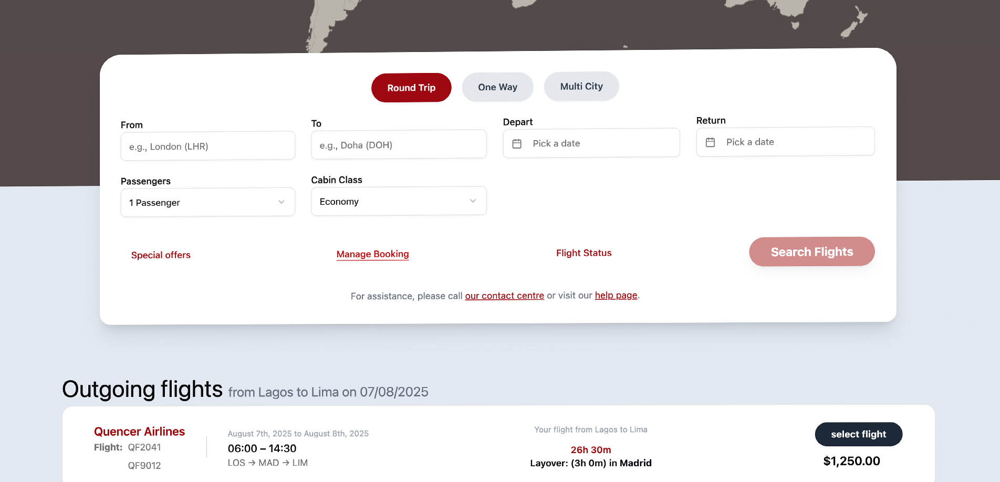

# ✈️ Quencer Airlines Booking Platform



## ✨ Project Overview

This is a full-stack web application for Quencer Airlines, designed to provide a seamless flight booking experience for users and efficient ticket management on the backend.

The **frontend**, built with **Vite** and styled with **Tailwind CSS**, offers a modern and responsive user interface for searching and booking flights.

The **backend**, developed with **Node.js** (Express.js), handles all business logic, including processing flight reservations, dynamically generating printable PDF e-tickets using Puppeteer, and sending automated booking confirmation emails with Nodemailer.

---

## 🚀 Features

- **User-Friendly Frontend:** Modern UI for flight search and booking.
- **Secure Booking Process:** Handles reservation requests and validates data.
- **Dynamic E-Ticket Generation:** Creates a realistic, single-page PDF e-ticket with booking and flight details.
- **Automated Email Confirmation:** Sends comprehensive booking confirmation emails with the generated e-ticket attached.
- **Flight Data Management:** (Implied) Backend capabilities to manage flight information.
- **Scalable Architecture:** Designed with separate frontend and backend for better maintainability and scalability.

---

## 🛠️ Tech Stack

### Frontend

- **Vite:** Fast build tool and development server.
- **React (or your preferred framework):** (Assumed based on Vite usage, specify if different, e.g., Vue, Svelte) For building the user interface.
- **Tailwind CSS:** Utility-first CSS framework for rapid UI development.

### Backend

- **Node.js:** JavaScript runtime.
- **Express.js:** Web application framework for API creation.
- **Puppeteer:** Node library to control headless Chrome/Chromium for PDF generation.
- **@sparticuz/chromium:** A lightweight, serverless-compatible Chromium binary for Puppeteer (for PDF generation).
- **Nodemailer:** Module for sending emails.
- **Dotenv:** For managing environment variables.
- **`asyncWrapper`:** (Assumed utility) For simplified asynchronous error handling.

---

## ⚙️ Getting Started

Follow these steps to set up and run both the frontend and backend components of the application on your local machine.

### Prerequisites

- Node.js (LTS version recommended)
- npm or Yarn (package manager)
- Git

# Backend .env variables

- **PORT=5000 #** Or any desired port for the backend API

- **EMAIL_HOST=** smtp.your-email-provider.com
- **EMAIL_PORT=** 587 # or 465 for SSL/TLS
- **EMAIL_SECUR** E=false # true for 465, false for 587 (TLS requires STARTTLS)
- **EMAIL_USER=** your_email@example.com
- **EMAIL_PASS=** your_email_password

### 1. Clone the Repository

```bash
git clone [https://github.com/jeslor/airline_app](https://github.com/jeslor/airline_app)
cd airline_app
```
